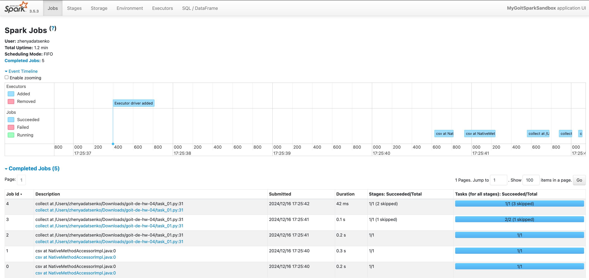
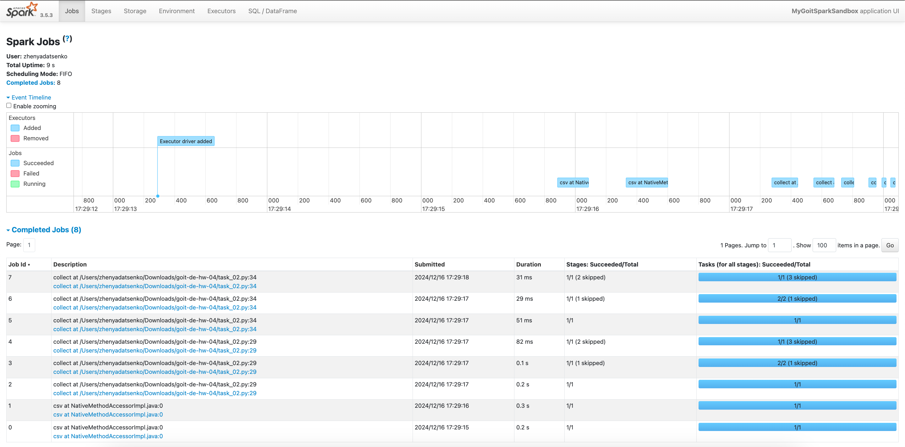
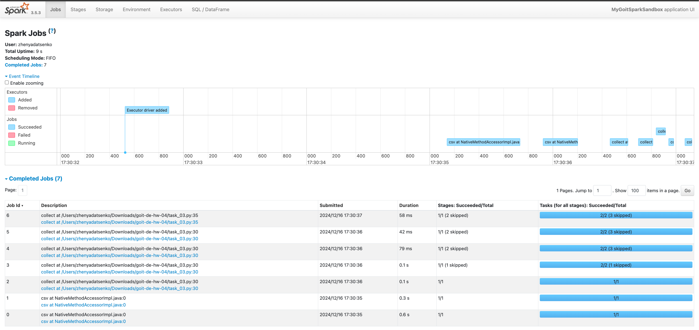

# Apache Spark: Optimization and SparkUI

Welcome to the homework assignment for the topic **"Apache Spark: Optimization and SparkUI."** This exercise is designed to deepen your understanding of Spark’s optimization features and how to analyze SparkUI.

---

### 📝 Assignment Overview

In this homework, you will run pre-written code snippets, observe the SparkUI, and analyze the behavior of Spark jobs under different conditions. The focus is on understanding the following:

- **Jobs Analysis:** Analyzing the number and structure of jobs in SparkUI.
- **Intermediate Actions:** How intermediate actions (like `collect`) affect job execution.
- **Caching:** The role of the `cache()` function in optimizing Spark jobs.

---

### ⚙️ Tasks and Steps

#### **Part 1: Baseline Code Execution**

1. **Objective:** Add a filter step and observe the changes in job execution.
2. **Steps:**
   - Use the provided baseline code.
   - Run the script and analyze the SparkUI.
   - **Expected Outcome:** The script should generate **5 jobs** in SparkUI.
3. **Key Code:**

   ```python
   nuek_processed = nuek_processed.where("count > 2")
   nuek_processed.collect()
   ```

4. **Deliverable: Take a screenshot of the jobs in SparkUI.**

#### **Part 2: Adding an Intermediate Action**

1. Objective: Understand the effect of adding the collect() action before applying further transformations.
2. Steps:
   • Modify the code to include an intermediate action (nuek_processed.collect()).
   • Run the script and analyze the SparkUI.
   • Expected Outcome: The script should generate 8 jobs in SparkUI.
3. Key Question: Why does adding an intermediate collect() increase the number of jobs by 3?
4. Deliverable: Take a screenshot of the jobs in SparkUI and provide reasoning for the additional jobs.

#### **Part 3: Leveraging cache() for Optimization**

1. Objective: Optimize the workflow by caching intermediate data.
2. Steps:
   • Use the cache() function on the intermediate result (nuek_processed_cached).
   • Run the script and analyze the SparkUI.
   • Expected Outcome: The script should generate 7 jobs in SparkUI. 3. Key Code:

```nuek_processed_cached = nuek_repart \
 .where("final_priority < 3") \
 .select("unit_id", "final_priority") \
 .groupBy("unit_id") \
 .count() \
 .cache()
```

4. Key Question: Why does using cache() reduce the number of jobs compared to the previous step?
5. Deliverable: Take a screenshot of the jobs in SparkUI and explain the optimization achieved through caching.

### Results






